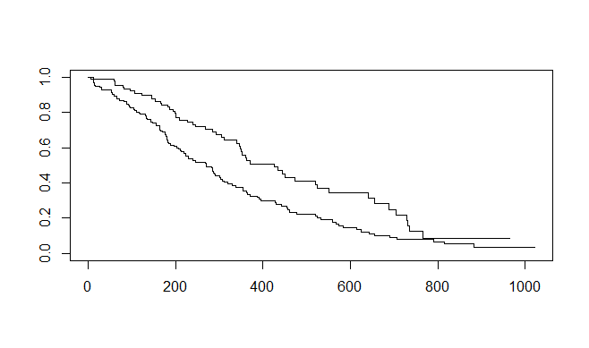
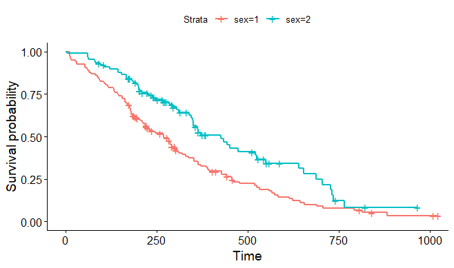
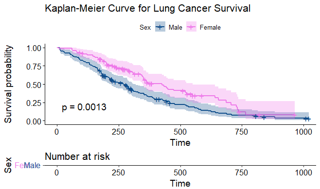
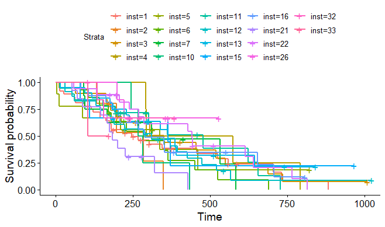
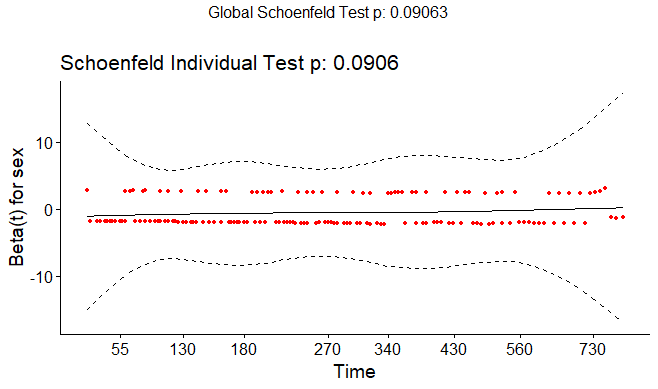
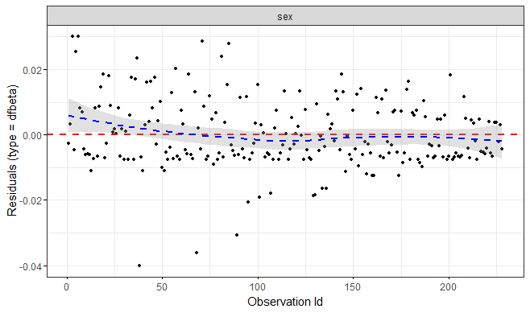
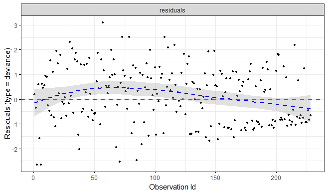

# Survival Analysis

## Overview
**Survival analysis** lets you analyze the rates of occurrence of events over time, without assuming the rates are constant. Generally, survival analysis lets you model the time until an event occurs, or compare the time-to-event between different groups, or how time-to-event correlates with quantitative variables.

The **hazard** is the instantaneous event (death) rate at a particular time point t. Survival analysis doesn’t assume the hazard is constant over time. The cumulative hazard is the total hazard experienced up to time t.

The **survival function**, is the probability an individual survives (or, the probability that the event of interest does not occur) up to and including time t. It’s the probability that the event (e.g., death) hasn’t occured yet. It looks like this, where T is the time of death, and $$Pr(T>t)$$ is the probability that the time of death is greater than some time t. S is a probability, so $$0≤S(t)≤1$$, since survival times are always positive (T≥0).

$$ S(t)= P_r(T>t) $$

The **Kaplan-Meier curve** illustrates the survival function. It’s a step function illustrating the cumulative survival probability over time. The curve is horizontal over periods where no event occurs, then drops vertically corresponding to a change in the survival function at each time an event occurs.

**Censoring** is a type of missing data problem unique to survival analysis. This happens when you track the sample/subject through the end of the study and the event never occurs. This could also happen due to the sample/subject dropping out of the study for reasons other than death, or some other loss to followup. The sample is censored in that you only know that the individual survived up to the loss to followup, but you don’t know anything about survival after that.

**Proportional hazards assumption**: The main goal of survival analysis is to compare the survival functions in different groups, e.g., leukemia patients as compared to cancer-free controls. If you followed both groups until everyone died, both survival curves would end at 0%, but one group might have survived on average a lot longer than the other group. Survival analysis does this by comparing the hazard at different times over the observation period. Survival analysis doesn’t assume that the hazard is constant, but does assume that the ratio of hazards between groups is constant over time. This class does not cover methods to deal with non-proportional hazards, or interactions of covariates with the time to event.

**Proportional hazards regression** a.k.a. Cox regression is the most common approach to assess the effect of different variables on survival.

## Cox Proportional Hazards Model
Kaplan-Meier curves are good for visualizing differences in survival between two categories5, but they do not work well for assessing the effect of quantitative variables like age, gene expression, leukocyte count, etc.

Cox proportional hazards (PH) regression can assess the effect of both categorical and continuous variables, and can model the effect of multiple variables at once.

Cox PH regression models the natural log of the hazard at time t, denoted by h(t), as a function of the baseline hazard, *h<sub>0</sub>(t)* (the hazard for an individual where all exposure variables are 0), and multiple exposure variables *x1, x2,…, xp*.

$$ log(h(t))=log(h_0(t))+\beta_1x_1 +\beta_2x_2 + ... + \beta_px_p $$

If we limit the right hand side to just a single categorical exposure variable (x<sub>1</sub>) with two groups (x1]<sub>1</sub>=1 for exposed and x<sub>1</sub>=0 for unexposed), the previous equation is equivalent to:

$$ h_1(t)=h_0(t)+e $$

HR(t)  is the hazard ratio, comparing the exposed to the unexposed individuals at time t.

This model shows that the hazard ratio is $$e^{β_1}$$ 
and remains constant over time t (hence the name proportional hazards regression).

The βs are the regression coefficients that are estimated from the model, and represent the log(HR) for each unit increase in the corresponding predictor variable.

The interpretation of the hazard ratio depends on the measurement scale of the predictor variable. In simple terms for the variable in question,
- a β>0 indicates more hazard than baseline and hence worse survival, and
- a β<0 indicates less hazard than baseline and hence better survival.

## Getting Started with R

The core survival analysis functions are in the survival package. The survival package is one of the few “core” packages that comes bundled with your basic R installation, so you probably did not need to use `install.packages()`. However, you will need to load it like any other library when you want to use it.

We will also want to load the survminer package, which provides much nicer Kaplan-Meier plots compared to base graphics.

```r
library(survival)  # core survival analysis function
library(survminer) # recommended for visualizing survival curves
```

The core functions we will use out of the survival package include:

- `Surv()`: creates the response variable (survival object), and typical usage takes the time-to-event,6 and whether or not the event occurred (i.e., death vs censored).
- `survfit()`: Fits a survival curve using either a formula, or a previously fitted Cox model. It creates a survival curve which could be displayed or plotted.
- `coxph()`: Fits a Cox proportional hazards regression model. Models are specified the same way as in regular linear models (e.g. lm()).

Other optional functions you might use include:

- `cox.zph()`: Tests the proportional hazards assumption of a Cox regression model.
- `survdiff()`: Tests for differences in survival between two groups using a log-rank / Mantel-Haenszel test

We will use the built-in lung cancer data set8 in the survival package. You can get some more information about the data set by running ?lung.

```r
library(survival)
?lung
```

`inst`: Institution code

`time`: Survival time in days

`status`: censoring status 1=censored, 2=dead

`age`: Age in years

`sex`: Male=1 Female=2

`ph.ecog`: ECOG performance score (0=good 5=dead)

`ph.karno`: Karnofsky performance score as rated by physician

`pat.karno`: Karnofsky performance score as rated by patient

`meal.cal`: Calories consumed at meals

`wt.loss`: Weight loss in last six months

```r
dim(lung) # returns the dimensions of the data frame
head(lung) # returns the first few rows from the data
View(lung) # opens the data in the viewer pane
```

## Survival Curves
### `Surv()`
This is the main function we will use to create the survival object.

They will match time and event in that order.

This is the common shorthand for right-censored data. The alternative lets you specify interval data, where you give it the start and end times (time and time2).

`Surv` function tries to guess the coding of the status variable. It will try to guess whether you are using 0/1 or 1/2 to represent censored vs death, respectively.

```r
s = Surv(lung$time, lung$status)
s
```

Output :

```
 [1]  306   455  1010+  210   883  1022+  310   361   218   166   170   654   728    71   567   144   613 
 [18]  707    61    88   301    81   624   371   394   520   574   118   390    12   473    26   533   107 
 [35]   53   122   814   965+   93   731   460   153   433   145   583    95   303   519   643   765   735 
 [52]  189    53   246   689    65     5   132   687   345   444   223   175    60   163    65   208   821+
 [69]  428   230   840+  305    11   132   226   426   705   363    11   176   791    95   196+  167   806+
 [86]  284   641   147   740+  163   655   239    88   245   588+   30   179   310   477   166   559+  450 
[103]  364   107   177   156   529+   11   429   351    15   181   283   201   524    13   212   524   288 
[120]  363   442   199   550    54   558   207    92    60   551+  543+  293   202   353   511+  267   511+
[137]  371   387   457   337   201   404+  222    62   458+  356+  353   163    31   340   229   444+  315+
[154]  182   156   329   364+  291   179   376+  384+  268   292+  142   413+  266+  194   320   181   285 
[171]  301+  348   197   382+  303+  296+  180   186   145   269+  300+  284+  350   272+  292+  332+  285 
[188]  259+  110   286   270    81   131   225+  269   225+  243+  279+  276+  135    79    59   240+  202+
[205]  235+  105   224+  239   237+  173+  252+  221+  185+   92+   13   222+  192+  183   211+  175+  197+
[222]  203+  116   188+  191+  105+  174+  177+
```

### `survfit()`
Fit a survival curve with the survfit() function.

```r
sfit = survfit(s~1)
# or we can also use the following
sfit = survfit(Surv(time, status)~1, data=lung)
# sfit

summary(sfit)
```

Output

```
Call: survfit(formula = Surv(time, status) ~ 1, data = lung)

 time n.risk n.event survival std.err lower 95% CI upper 95% CI
    5    228       1   0.9956 0.00438       0.9871        1.000
   11    227       3   0.9825 0.00869       0.9656        1.000
   12    224       1   0.9781 0.00970       0.9592        0.997
   13    223       2   0.9693 0.01142       0.9472        0.992
   15    221       1   0.9649 0.01219       0.9413        0.989
   26    220       1   0.9605 0.01290       0.9356        0.986
   30    219       1   0.9561 0.01356       0.9299        0.983
   31    218       1   0.9518 0.01419       0.9243        0.980
   53    217       2   0.9430 0.01536       0.9134        0.974
   54    215       1   0.9386 0.01590       0.9079        0.970
   59    214       1   0.9342 0.01642       0.9026        0.967
   60    213       2   0.9254 0.01740       0.8920        0.960
   61    211       1   0.9211 0.01786       0.8867        0.957
   62    210       1   0.9167 0.01830       0.8815        0.953
   65    209       2   0.9079 0.01915       0.8711        0.946
   71    207       1   0.9035 0.01955       0.8660        0.943
   79    206       1   0.8991 0.01995       0.8609        0.939
   81    205       2   0.8904 0.02069       0.8507        0.932
   88    203       2   0.8816 0.02140       0.8406        0.925
   92    201       1   0.8772 0.02174       0.8356        0.921
   93    199       1   0.8728 0.02207       0.8306        0.917
   95    198       2   0.8640 0.02271       0.8206        0.910
  105    196       1   0.8596 0.02302       0.8156        0.906
  107    194       2   0.8507 0.02362       0.8056        0.898
  110    192       1   0.8463 0.02391       0.8007        0.894
  116    191       1   0.8418 0.02419       0.7957        0.891
  118    190       1   0.8374 0.02446       0.7908        0.887
  122    189       1   0.8330 0.02473       0.7859        0.883
  131    188       1   0.8285 0.02500       0.7810        0.879
  132    187       2   0.8197 0.02550       0.7712        0.871
  135    185       1   0.8153 0.02575       0.7663        0.867
  142    184       1   0.8108 0.02598       0.7615        0.863
  144    183       1   0.8064 0.02622       0.7566        0.859
  145    182       2   0.7975 0.02667       0.7469        0.852
  147    180       1   0.7931 0.02688       0.7421        0.848
  153    179       1   0.7887 0.02710       0.7373        0.844
  156    178       2   0.7798 0.02751       0.7277        0.836
  163    176       3   0.7665 0.02809       0.7134        0.824
  166    173       2   0.7577 0.02845       0.7039        0.816
  167    171       1   0.7532 0.02863       0.6991        0.811
  170    170       1   0.7488 0.02880       0.6944        0.807
  175    167       1   0.7443 0.02898       0.6896        0.803
  176    165       1   0.7398 0.02915       0.6848        0.799
  177    164       1   0.7353 0.02932       0.6800        0.795
  179    162       2   0.7262 0.02965       0.6704        0.787
  180    160       1   0.7217 0.02981       0.6655        0.783
  181    159       2   0.7126 0.03012       0.6559        0.774
  182    157       1   0.7081 0.03027       0.6511        0.770
  183    156       1   0.7035 0.03041       0.6464        0.766
  186    154       1   0.6989 0.03056       0.6416        0.761
  189    152       1   0.6943 0.03070       0.6367        0.757
  194    149       1   0.6897 0.03085       0.6318        0.753
  197    147       1   0.6850 0.03099       0.6269        0.749
  199    145       1   0.6803 0.03113       0.6219        0.744
  201    144       2   0.6708 0.03141       0.6120        0.735
  202    142       1   0.6661 0.03154       0.6071        0.731
  207    139       1   0.6613 0.03168       0.6020        0.726
  208    138       1   0.6565 0.03181       0.5970        0.722
  210    137       1   0.6517 0.03194       0.5920        0.717
  212    135       1   0.6469 0.03206       0.5870        0.713
  218    134       1   0.6421 0.03218       0.5820        0.708
  222    132       1   0.6372 0.03231       0.5769        0.704
  223    130       1   0.6323 0.03243       0.5718        0.699
  226    126       1   0.6273 0.03256       0.5666        0.694
  229    125       1   0.6223 0.03268       0.5614        0.690
  230    124       1   0.6172 0.03280       0.5562        0.685
  239    121       2   0.6070 0.03304       0.5456        0.675
  245    117       1   0.6019 0.03316       0.5402        0.670
  246    116       1   0.5967 0.03328       0.5349        0.666
  267    112       1   0.5913 0.03341       0.5294        0.661
  268    111       1   0.5860 0.03353       0.5239        0.656
  269    110       1   0.5807 0.03364       0.5184        0.651
  270    108       1   0.5753 0.03376       0.5128        0.645
  283    104       1   0.5698 0.03388       0.5071        0.640
  284    103       1   0.5642 0.03400       0.5014        0.635
  285    101       2   0.5531 0.03424       0.4899        0.624
  286     99       1   0.5475 0.03434       0.4841        0.619
  288     98       1   0.5419 0.03444       0.4784        0.614
  291     97       1   0.5363 0.03454       0.4727        0.608
  293     94       1   0.5306 0.03464       0.4669        0.603
  301     91       1   0.5248 0.03475       0.4609        0.597
  303     89       1   0.5189 0.03485       0.4549        0.592
  305     87       1   0.5129 0.03496       0.4488        0.586
  306     86       1   0.5070 0.03506       0.4427        0.581
  310     85       2   0.4950 0.03523       0.4306        0.569
  320     82       1   0.4890 0.03532       0.4244        0.563
  329     81       1   0.4830 0.03539       0.4183        0.558
  337     79       1   0.4768 0.03547       0.4121        0.552
  340     78       1   0.4707 0.03554       0.4060        0.546
  345     77       1   0.4646 0.03560       0.3998        0.540
  348     76       1   0.4585 0.03565       0.3937        0.534
  350     75       1   0.4524 0.03569       0.3876        0.528
  351     74       1   0.4463 0.03573       0.3815        0.522
  353     73       2   0.4340 0.03578       0.3693        0.510
  361     70       1   0.4278 0.03581       0.3631        0.504
  363     69       2   0.4154 0.03583       0.3508        0.492
  364     67       1   0.4092 0.03582       0.3447        0.486
  371     65       2   0.3966 0.03581       0.3323        0.473
  387     60       1   0.3900 0.03582       0.3258        0.467
  390     59       1   0.3834 0.03582       0.3193        0.460
  394     58       1   0.3768 0.03580       0.3128        0.454
  426     55       1   0.3700 0.03580       0.3060        0.447
  428     54       1   0.3631 0.03579       0.2993        0.440
  429     53       1   0.3563 0.03576       0.2926        0.434
  433     52       1   0.3494 0.03573       0.2860        0.427
  442     51       1   0.3426 0.03568       0.2793        0.420
  444     50       1   0.3357 0.03561       0.2727        0.413
  450     48       1   0.3287 0.03555       0.2659        0.406
  455     47       1   0.3217 0.03548       0.2592        0.399
  457     46       1   0.3147 0.03539       0.2525        0.392
  460     44       1   0.3076 0.03530       0.2456        0.385
  473     43       1   0.3004 0.03520       0.2388        0.378
  477     42       1   0.2933 0.03508       0.2320        0.371
  519     39       1   0.2857 0.03498       0.2248        0.363
  520     38       1   0.2782 0.03485       0.2177        0.356
  524     37       2   0.2632 0.03455       0.2035        0.340
  533     34       1   0.2554 0.03439       0.1962        0.333
  550     32       1   0.2475 0.03423       0.1887        0.325
  558     30       1   0.2392 0.03407       0.1810        0.316
  567     28       1   0.2307 0.03391       0.1729        0.308
  574     27       1   0.2221 0.03371       0.1650        0.299
  583     26       1   0.2136 0.03348       0.1571        0.290
  613     24       1   0.2047 0.03325       0.1489        0.281
  624     23       1   0.1958 0.03297       0.1407        0.272
  641     22       1   0.1869 0.03265       0.1327        0.263
  643     21       1   0.1780 0.03229       0.1247        0.254
  654     20       1   0.1691 0.03188       0.1169        0.245
  655     19       1   0.1602 0.03142       0.1091        0.235
  687     18       1   0.1513 0.03090       0.1014        0.226
  689     17       1   0.1424 0.03034       0.0938        0.216
  705     16       1   0.1335 0.02972       0.0863        0.207
  707     15       1   0.1246 0.02904       0.0789        0.197
  728     14       1   0.1157 0.02830       0.0716        0.187
  731     13       1   0.1068 0.02749       0.0645        0.177
  735     12       1   0.0979 0.02660       0.0575        0.167
  765     10       1   0.0881 0.02568       0.0498        0.156
  791      9       1   0.0783 0.02462       0.0423        0.145
  814      7       1   0.0671 0.02351       0.0338        0.133
  883      4       1   0.0503 0.02285       0.0207        0.123
```

Fit survival curves separately by sex.

```r
sfit = survfit(Surv(time, status)~sex, data=lung)
sfit
```

Output

```
Call: survfit(formula = Surv(time, status) ~ 1, data = lung)

       n events median 0.95LCL 0.95UCL
[1,] 228    165    310     285     363
```

## Kaplan-Meier Plots

Kaplan-Meier plot is used to visualize the survival curve fit to the data.
To do this we can use the `plot()` function on the fitted survival curve sfit.

```r
sfit = survfit(Surv(time, status)~sex, data=lung)
plot(sfit)
```

Output :



### `ggsurvplot()`
It is much easier to produce publication-ready survival plots, and if you are familiar with `ggplot2` syntax it is pretty easy to modify.

```r
library(survminer)
ggsurvplot(sfit)
```

Output :



```r
ggsurvplot(sfit,
           conf.int=TRUE, # add confidence intervals
           pval=TRUE, # show the p-value for the log-rank test
           risk.table=TRUE, # show a risk table below the plot
           legend.labs=c("Male", "Female"), # change group labels
           legend.title="Sex",  # add legend title
           palette=c("dodgerblue4", "orchid2"), # change colors of the groups
           title="Kaplan-Meier Curve for Lung Cancer Survival", # add title to plot
           risk.table.height=.2)
```

Output :



## Cox Regression

Kaplan-Meier curves are good for visualizing differences in survival between two categorical groups. The p-value for the log-rank test provided when pval=TRUE is also useful for identifying any differences in survival between different groups.

However, this does not generalize well for assessing the effect of quantitative variables.

Just try creating a K-M plot for the nodes variable, which has values that range from 0−33.

```r
ggsurvplot(survfit(Surv(time, status)~inst, data=lung))
```

Output :



At some point using a categorical grouping for K-M plots breaks down, more so when we might want to assess how multiple variables work together to influence survival.

For example, we might want to simultaneously examine the effect of race and socioeconomic status (so as to adjust for factors like income, access to care, etc.) before concluding that ethnicity influences some outcome.

### Model Fit
Cox PH regression can assess the effect of both categorical and continuous variables, and can model the effect of multiple variables at once.

The `coxph()` function uses the same syntax as `lm()`, `glm()`, etc.

```r
fit = coxph(Surv(time, status)~sex, data=lung)
fit
```

Output :

```
Call:
coxph(formula = Surv(time, status) ~ sex, data = lung)

       coef exp(coef) se(coef)      z       p
sex -0.5310    0.5880   0.1672 -3.176 0.00149

Likelihood ratio test=10.63  on 1 df, p=0.001111
n= 228, number of events= 165 
```

The `exp(coef)` column contains $$e^β_1$$. This is the hazard ratio – the multiplicative effect of that variable on the hazard rate (for each unit increase in that variable).

For a categorical variable like `sex`, going from male (baseline) to female results in approximately ~40% reduction in hazard.

We could also flip the sign on the `coef` column, and take `exp(0.531)`, which can be interpreted as:

- Males have a 1.7-fold increase in hazard, or that
- Males die at approximately 1.7× the rate per unit time as females (females die at 0.588× the rate per unit time as males).

Remember:

- HR=1: No effect
- HR>1: Increase in hazard
- HR<1: Decrease in hazard

There is a p-value on the sex term, and a p-value on the overall model.

- That 0.00111 p-value is really close to the p=0.00131 p-value we saw on the Kaplan-Meier plot.
- That is because the KM plot is showing the log-rank test p-value.


We can get this out of the Cox model with a call to `summary(fit)`.
```r
summary(fit)
```
Output
```
Call:
coxph(formula = Surv(time, status) ~ sex, data = lung)

  n= 228, number of events= 165 

       coef exp(coef) se(coef)      z Pr(>|z|)   
sex -0.5310    0.5880   0.1672 -3.176  0.00149 **
---
Signif. codes:  0 ‘***’ 0.001 ‘**’ 0.01 ‘*’ 0.05 ‘.’ 0.1 ‘ ’ 1

    exp(coef) exp(-coef) lower .95 upper .95
sex     0.588      1.701    0.4237     0.816

Concordance= 0.579  (se = 0.021 )
Likelihood ratio test= 10.63  on 1 df,   p=0.001
Wald test            = 10.09  on 1 df,   p=0.001
Score (logrank) test = 10.33  on 1 df,   p=0.001
```

We can directly calculate the log-rank test p-value using `survdiff()`.
```r
survdiff(Surv(time, status)~sex, data=lung)
```


Output
```
Call:
survdiff(formula = Surv(time, status) ~ sex, data = lung)

        N Observed Expected (O-E)^2/E (O-E)^2/V
sex=1 138      112     91.6      4.55      10.3
sex=2  90       53     73.4      5.68      10.3

 Chisq= 10.3  on 1 degrees of freedom, p= 0.001 
```

### Testing Proportional Hazards Assumption
The proportional hazards (PH) assumption can be checked using statistical tests and graphical diagnostics based on the scaled Schoenfeld residuals.

In principle, the Schoenfeld residuals are independent of time. A plot that shows a non-random pattern against time is evidence of violation of the PH assumption.

The function `cox.zph()` provides a convenient solution to test the proportional hazards assumption for each covariate included in a Cox regression model fit.

```r
test.ph = cox.zph(fit)
test.ph
```

Output

```
       chisq df     p
sex     2.86  1 0.091
GLOBAL  2.86  1 0.091
```

graphical diagnostic using the function ggcoxzph()

```r
ggcoxzph(test.ph)
```

Output :



### Testing Influential Observations

```r
ggcoxdiagnostics(fit, type = "dfbeta",
                 linear.predictions = FALSE, ggtheme = theme_bw())
```

Output :



### Outliers by visualizing the deviance residuals

```r
ggcoxdiagnostics(fit, type = "deviance",
                 linear.predictions = FALSE, ggtheme = theme_bw())
```

Output :


